## Airbnb Superhost Analysis Overview

Have you thought about being an Airbnb host? While booking properties, you might have seen a cool title for experienced, excellent hosts called "Superhost". To get this title, you have to meet several criteria, and this analysis attempts to quantify the value of having this title for your business.

## Identification Strategy

The main question is **"What is the effect of having Superhost status on bookings for the host's listings?"**

Our approach will involve a fuzzy regression discontinuity design.

Y = num_reviews_l12m
X = avg_host_review_score
D = has_superhost

### Causal DAG



The threshold indicator **Z = 1[R ≥ 4.8]** acts as an instrument for actual Superhost status (D). Because Z is a deterministic function of the running variable R, it satisfies the relevance condition — crossing the 4.8 cutoff sharply increases the probability of receiving Superhost status.

The key identifying assumption is **smoothness**: the direct effect of the overall rating R on bookings Y is smooth through the cutoff. Under this assumption, the direct path R → Y cannot produce a discontinuity at 4.8. Any jump in Y at the threshold must therefore flow through D (Superhost status), allowing us to identify the **Local Average Treatment Effect (LATE)** via the ratio of the reduced-form discontinuity to the first-stage discontinuity.

## Notes on data cleaning
- data was transformed from listing granularity to host granularity because metrics like response rate and overall rating are on the host level
- the tenure (in days) of a host is defined as the number of days between the host_since date and the last_scraped date

## How to become a Superhost

Technically, there are 4 evaluation periods throughout the quarter where qualifying hosts can become superhosts. These four criteria are computed using the host's data from the past 365 days:  
1. Host at least 10 reservations OR 3 reservations that total at least 100 nights over three stays.  
2. Cancelation rate < 10%  
3. at least a 90% response rate  
4. at least a 4.8 overall rating  

Only 1 and 4 are in the dataset, and the overall host rating is the only reliably measured metric. Therefore 

### Setup

1. Clone repo
2. Run download.py, which will create the data/ directory, containing the raw listings
3. Run load.py, which will create a listings.db file in the data/ directory, which is the DuckDB database


## dbt Pipeline

```
listings (source)
    └── stg_listings_filtered_cols
            └── int_listings_deduped
                    └── int_listings_aggregated_stats
                                └── mart_listings_fuzzy_rdd
```

| Model | Layer | Grain | Purpose |
|---|---|---|---|
| `listings` | Staging | listing × scrape month | View over raw source CSV data |
| `listings_filtered_cols` | Staging | listing × scrape month | Column selection and type casting (parses `host_response_rate` from "95%" → 95.0) |
| `listings_deduped` | Intermediate | listing (latest scrape) | Deduplicates panel data to one row per listing, keeping most recent scrape |
| `listings_aggregated_stats` | Intermediate | listing (latest scrape) | Adds `avg_host_review_score`: review-count-weighted average across all of a host's listings |
| `listings_fuzzy_rdd` | Mart | **host** | Final RDD dataset — one row per host, `num_reviews_l12m` summed across listings, binary treatment indicators |

To view interactive docs:

```bash
uv run dbt docs generate && uv run dbt docs serve
```

## TODO:
- Read over the pdf
- Try rewriting it to make sure you understand
